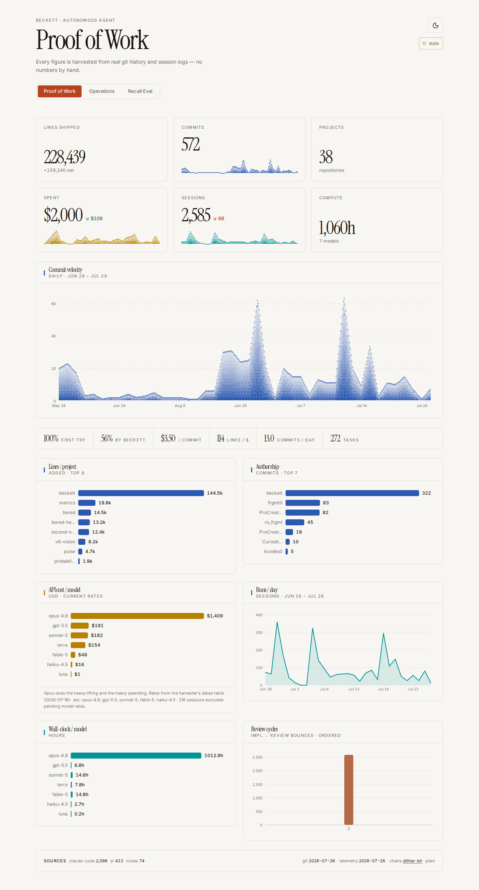
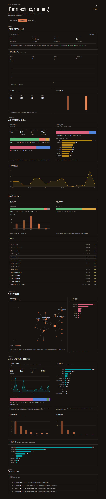

# Beckett — Proof of Work dashboard

Neo-brutalist, static **marketing** dashboard for Beckett — an autonomous coding agent — told
entirely in numbers and charts. Live at **https://metrics.0xbeckett.me**.

The page and its **back half** live together in this repository. The two vendored harvesters
originated in the Beckett tickets #8 and #26.3, but are deliberately ported here under
`scripts/harvest/`: scheduled refreshes do **not** depend on a hand-run command or checkout in
another repository.

- **Telemetry** (`scripts/harvest/telemetry.ts`) reads `~/.claude`, `~/.pi`, `~/.codex`, and the
  bored tracker to produce per-session model / cost / wall-clock / review-cycle rows.
- **Code stats** (`scripts/harvest/code-stats.ts`) reads `~/Projects/*` git history to produce
  LOC, commits, per-project rollups, authorship display names, and daily velocity. Known author
  identities are canonicalized through `config/author-aliases.json` before contributor buckets
  are aggregated.
- **Claude sessions** (`scripts/harvest/claude-sessions.ts`, #2) streams `~/.claude/projects/**/*.jsonl`
  — every Claude Code transcript on the host — incrementally (a per-file path/size/mtime/byte-offset
  cursor in `data/claude-sessions-state.json`) to produce one row per session: start hour, duration,
  turn count, tool-call counts by name, model, tokens, cost, error/permission-denial counts, and a
  worker/concierge/quick classification derived from the project directory shape. The session id is
  salted-hashed before it ever reaches a row; the salt lives in `data/.claude-sessions-salt`, never
  in a published document. No prompt text, tool arguments, tool output, or file path is ever read
  beyond a same-pass regex test (for a permission-denial phrase) whose matched text is discarded.

This app never recomputes cost, cycle counts, or LOC — it only reads, aggregates (sum/count),
and draws.

## Data flow

```
~/.claude · ~/.pi · ~/.codex · bored tracker        ~/Projects/* git history
        │  (telemetry harvester — #8)                       │  (code-stats harvester — #26.3)
        ▼                                                    ▼
data/telemetry-runs.json  (~1.6k run rows)          data/code-stats.json  (per-repo/author/day)
        └───────────────────┬────────────────────────────────┘
                            │  (scripts/prepare-data.mjs — build-time rollup, sum/count only)
                            ▼
             src/generated/metrics.json   telemetry aggregates + `codeStats` block (committed)
                            │  (initial vite build)
                            ▼
             dist/ + metrics.json           static shell → metrics.0xbeckett.me
                            ▲
                            │  (15-minute refresh atomically replaces only metrics.json)
```

`prepare-data.mjs` reads both datasets, rolls them into the chart shapes plus the headline
totals, and writes `src/generated/metrics.json`. It **does not** re-derive any metric — cost
(`cost_usd`), wall-clock (`wall_clock_seconds`), review bounces (`review_cycles`) and every
code-stats figure come straight from the harvesters' rows and are only summed/counted. It strips
emails and local paths, and refuses to write a public document if either remains. The refresh
also runs `scripts/verify-public-metrics.mjs` against the staged served JSON.

Point it at different datasets with `TELEMETRY_DATASET=/path/to/runs.json`,
`CODE_STATS_DATASET=/path/to/code-stats.json`, and `CLAUDE_SESSIONS_DATASET=/path/to/claude-sessions.json`.

## The page





A marketing piece, not an info panel: giant count-up hero figures (lines shipped, commits,
projects, spend, sessions, compute), a full-width commit-velocity timeline as the hero visual, a
strip of derived cost-per-outcome ratios (first-try rate, $/commit, lines/$, …), then a grid of
charts. Numbers count up on load and charts draw in — fast, and skipped under
`prefers-reduced-motion`. `src/derived.ts` computes the marketing projections; `src/motion.tsx`
holds the count-up hook and reveal wrapper.

## Charts

Two kits share one token system. The textured showpieces (commit velocity, the delivery trend,
the hero sparklines, the recall head-to-head) render with
[**dither-kit**](https://www.tripwire.sh/dither-kit) (`@dither-kit/*`, installed into
`src/components/dither-kit/`); the dense panels use the plain hairline SVG set in
`src/components/charts-plain.tsx`. Both read their colours from the same CSS custom properties,
so a token change moves the canvas kit and the SVG kit together.

| View | Source | Kit |
|------|--------|-----|
| Commit velocity (daily, hero) | code stats | dither `AreaChart` |
| Delivery trend (tickets closed) | tickets | dither `AreaChart` |
| Recall head-to-head (luna vs haiku) | recall eval | dither `BarChart` |
| Hero-stat sparklines | both | dither `Sparkline` |
| Rankings (projects, authors, models, tools) | all | plain `BarsPlain` |
| Time series (runs, spend, sessions, tickets) | all | plain `LinePlain` |
| Ordered buckets (duration, turns, cycles) | all | plain `ColumnsPlain` |
| Splits (outcomes, stages, classifications) | all | plain `ProportionBar` |

### Colour

The palette lives once, in `src/index.css`, as `:root` / `.dark` token pairs; `src/palette.ts`
maps *meaning* onto those tokens and holds no colour values of its own.

- **`--series-1..6`** — the categorical palette (rose · indigo · moss · violet · gold · teal), a
  fixed order that is never cycled. A measure keeps its slot across the whole page: commits are
  indigo, sessions teal, spend gold, tickets closed moss and opened violet, memory rose. Series
  that share a chart take *adjacent* slots, because only neighbours are validated against each
  other. A nominal ranking wears the single hue of what it measures — bar length already carries
  the ranking, and the row label carries the identity.
- **`--seq-1..5`** — a one-hue clay ramp for ordered magnitude: bucket columns and memory-graph
  node degree. The anchor flips in dark mode so "more" always moves away from the surface.
- **`--good` / `--warn` / `--critical`** — reserved status steps, never reused as a series hue and
  always paired with a glyph or the word itself.

Validated with the dataviz skill's `validate_palette.js` against the real surfaces (`#f8f6f2` /
`#161311`) on the adjacent pairlist: worst adjacent CVD ΔE **14.0** light / **14.1** dark (target
≥ 8), worst normal-vision ΔE **20.6** / **20.2** (floor ≥ 15), all six slots ≥ 3:1 against their
surface. Six is also the ceiling — no six-colour set can clear the all-pairs test, so
scatter-style forms are deliberately absent. Every rendered text colour clears WCAG AA in both
themes (worst measured 4.57:1 light, 5.98:1 dark).

## Develop / build

```sh
bun install
bun run refresh        # harvest both sources, roll up, privacy-check, atomically publish JSON
bun run dev            # local dev server
bun run build          # → dist/ + dist/metrics.json (runs prepare-data first)
bun run typecheck
```

`bun run refresh` is the single end-to-end command. It invokes both vendored harvesters,
regenerates `src/generated/metrics.json`, verifies that no email or absolute local path is
public, then atomically renames the result into the served `metrics.json`. The React shell fetches
that file with `cache: "no-store"` on page load, so routine refreshes do not need a Vite rebuild.
The footer's **updated** stamp is the rollup timestamp in that file.

## Deploy

Static build, served on `127.0.0.1:8971` by a durable `systemd --user` unit and exposed through
Beckett's Cloudflare tunnel.

```sh
# 1. Initial shell deployment (the refresh below places its live JSON in this directory).
bun run refresh
bun run build
mkdir -p ~/.local/share/beckett-metrics/dist
cp -a dist/. ~/.local/share/beckett-metrics/dist/

# 2. Durable static server and automatic data refresh.
# The units assume this checkout is /home/beckett/Projects/metrics; edit both paths if moved.
cp deploy/beckett-metrics.service deploy/beckett-metrics-refresh.{service,timer} ~/.config/systemd/user/
systemctl --user daemon-reload
systemctl --user enable --now beckett-metrics.service beckett-metrics-refresh.timer
loginctl enable-linger beckett  # keep the user timer running across reboot/login absence

# 3. Tunnel + DNS (creates both) and verify
beckett deploy metrics --port 8971
curl -fsS http://127.0.0.1:8971/metrics.json | node scripts/verify-public-metrics.mjs /dev/stdin
systemctl --user list-timers beckett-metrics-refresh.timer
```

The timer is persistent, so after reboot systemd runs a missed cycle shortly after the user
manager starts, then every 15 minutes. `refresh-metrics.sh` writes a temporary file beside the
served file and `mv`s it into place only after both harvesters, rollup, and privacy checks pass.
A failure is logged to the service journal (`journalctl --user -u beckett-metrics-refresh.service`)
and leaves the last-good site untouched. For a shell/style deployment, run `bun run build` and
stage the new `dist` as above; ordinary data refreshes never restart the static server.

## Known data notes (flagged, not patched — see #8, out of scope here)

- **Opus dominates** both spend (~$871 of ~$1.1k) and wall-clock (~654h). The linear bars make
  the other five models look tiny — that is the honest shape of the data; exact values are on
  hover.
- **Rate estimates:** Claude `*-5`/`4-8` labels have no exact public SKU, so their cost is an
  estimate. The harvester marks these `rate_estimate: true`; the cost card footnotes which
  models are estimated.
- Anything that looks wrong is a harvester concern — flag it there, don't patch it in the UI.
